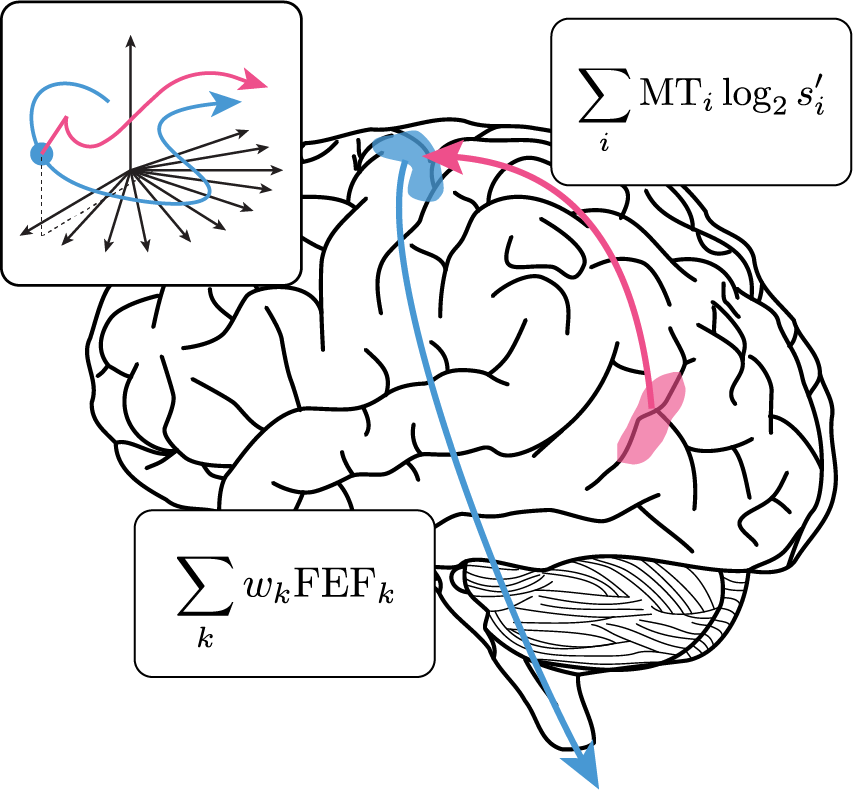

## Neural circuit computation of mental representation

Intelligent behavior arises through mental representations -- functional objects created by the brain that corresponds to features in the outside world can be formed and manipulated independently of sensory stimulation. We strive to understand how neural circuits implement the computations necessary to execute manipulations mental representations.

  

