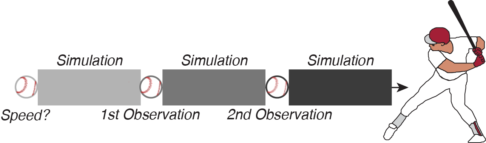
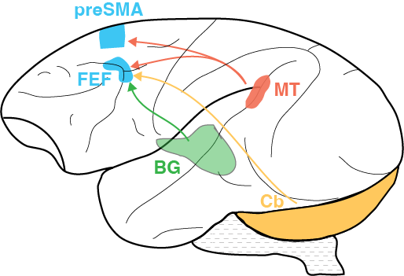
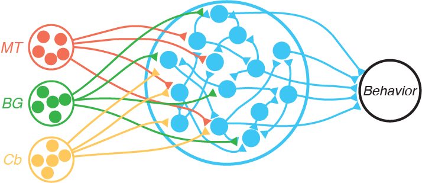


Our brains are made up of interconnected circuits of neurons that transform sensory experiences into complex and intelligent behavior. A key component of this transformation is the construction of mental representations – thoughts about the physical world that can be separated from direct sensory stimulation. In chess, for example, players use a mental representation of the board to simulate upcoming moves rather than physically move the pieces. While populations of neurons in a circuit have the capacity to produce activity independent of sensation, the link between circuit anatomy, individual neuron activity, and mental representations remains unclear.
 

  

 
We focus on tasks conceptually similar to a baseball player tracking and hitting a ball. However, we control the visibility of the ball to force the batter to build a mental representation that simulates the ball’s flight between moments when it is observable. Observations allow the hitter to update their estimates of the ball's speed and location. We take the perspective the combined circuits of the brain allow for this behavior, including frontal regions (FEF, preSMA) with recurrent circuitry capale of simulating the ball's path, sensory cortex (MT) with neurons that encode sensory information and drive downstream circuits, the basal ganglia (BG) with specialized roles in reward learning, and the cerebellum (Cb) with specialized roles in error learning.

  

 
 
How does the circuit anatomy of the brain give rise to dynamic population activity that supports mental representation? Answering this requires dissecting the contributions of recurrent frontal connections to the population response from external inputs to the system.

  

 
We build on advancements in neural network theory, behavioral psychophysics, and analysis of physiological signals to reveal how local frontal circuits form mental representations and how external inputs control how these representations evolve over time.
